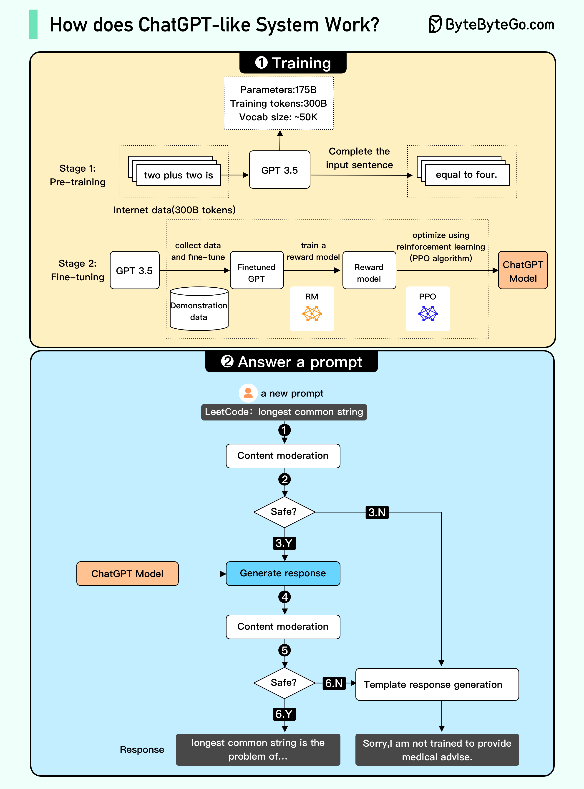

# Tabel of contents
- LLM
- RAG
- AI AGENT
- AGENTIC AI

# LLM
Some parts of the diagram may be inaccurate ( [reference](https://blog.bytebytego.com/p/ep-44-how-does-chatgpt-work?utm_source=publication-search) ) \

