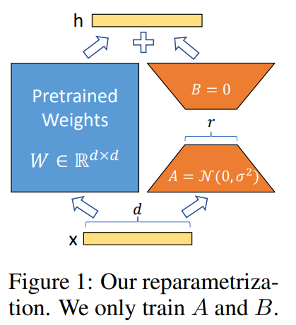

# Tabel of contents
- LLM
- RAG
- AI AGENT
- AGENTIC AI

# LLM
## Definition
- Trained on vast text data to learn language patterns.
- Predicts and generates text based on context.
- Powers tasks like Q&A, summarization, translation.  
👉 An AI model trained on massive text data to understand and generate human-like language

Some parts of the diagram may be inaccurate.([Bytebytego](https://blog.bytebytego.com/p/ep-44-how-does-chatgpt-work?utm_source=publication-search))

⚠️ LLMs can’t access real-time info, remember past chats, or reason deeply.  
✅ Solved with RAG, memory modules, function calling, and agents.

## Type of llm
| Model Type          | Data Examples                          | How It’s Trained (Simple)                                     | Example Model & Link |
|---------------------|-----------------------------------------|----------------------------------------------------------------|----------------------|
| **Base / Foundation** | Web text, books, code (e.g. CommonCrawl, GitHub, Wikipedia) | Self-supervised learning: next-token prediction on massive unlabeled data ([Medium](https://medium.com/%40yashwanths_29644/llm-finetuning-series-05-llm-architectures-base-instruct-and-chat-models-a6219c39c362), [Wikipedia](https://en.wikipedia.org/wiki/Llama_%28language_model%29)) | GPT‑3 before fine-tuning (OpenAI) |
| **Instruct‑tuned**   | Instruction-output pairs labeled by humans | Fine-tuning on prompt-response dataset; often with RLHF ([IBM](https://www.ibm.com/think/topics/instruction-tuning), [Toloka](https://toloka.ai/blog/base-llm-vs-instruction-tuned-llm)) | LLaMA‑2‑chat (Meta) |
| **Chat Models**      | Dialogue transcripts, conversation logs | Instruct tuning + multi-turn scenario alignment, system prompts ([ScrapingAnt](https://scrapingant.com/blog/llm-instruct-vs-chat), [Wikipedia](https://en.wikipedia.org/wiki/Claude_%28language_model%29)) | Claude 3 series (Anthropic) |
| **Code / Coder**     | Code repositories + natural language comments | Fine-tuned on NL↔code datasets; often with execution/test feedback ([arXiv](https://arxiv.org/abs/2002.08155), [ScienceDirect](https://www.sciencedirect.com/science/article/pii/S2949761224001147)) | Code Llama, CodeBERT |
| **Reasoning / Thinking** | Complex question–answer, chain-of-thought examples | Prompting with chain-of-thought or hybrid training plus external verification ([arXiv](https://arxiv.org/abs/2201.11903), [Wired](https://www.wired.com/story/anthropic-world-first-hybrid-reasoning-ai-model)) | Claude 3.7 hybrid reasoning |
| **Multimodal**       | Paired text + image/audio/video datasets | Pretrain on multiple modalities; supervised fine-tuning on aligned tasks ([Wikipedia](https://en.wikipedia.org/wiki/Gemini_%28language_model%29), [BentoML](https://www.bentoml.com/blog/multimodal-ai-a-guide-to-open-source-vision-language-models)) | GPT‑4, Phi‑4‑multimodal‑instruct ([Phi-4](https://huggingface.co/microsoft/Phi-4-multimodal-instruct)) |
| **Domain‑specific**  | Specialized data (e.g. medical texts, legal corpora) | Fine-tuning base or instruct model on curated domain dataset | Med‑PaLM (Google), Legal‑LLMs |

## [LoRA](https://arxiv.org/abs/2106.09685) (Low-Rank Adaptation)

- Instead of updating all model weights (like full fine-tuning), **LoRA freezes the base model** and trains **small adapter matrices**.
- These adapters are **low-rank matrices** added to key weights (e.g., W → W + A×B), requiring **far fewer parameters**.
- LoRA is **faster, cheaper, and uses less memory** than full fine-tuning, and the base model stays reusable.
- 🧠 Use case: Efficiently adapt large models to new tasks/domains with small memory/storage footprint.

### Tiny Numerical Example (LoRA)
- Suppose your model has a weight matrix **W** of shape `512 × 512` → **262,144** parameters.
- With **LoRA**, you freeze `W` and add two small matrices:
  - **A**: `512 × 4`
  - **B**: `4 × 512`
- Trainable parameters: `4 × 512 + 512 × 4 = 4,096` → **64× fewer!**
- The modified weight:  
  **W′ = W + α × (A × B)**  
  where `α` is a scaling factor (e.g. 16).
- ✅ `W` stays untouched; only `A` and `B` are learned.

## Function Calling
Function calling allows the model to:
- Know when and how to use tools (functions/APIs) during a conversation.
- Output structured JSON instead of plain text, making it easier for your code to handle responses.
- Let the LLM decide when to call a function, what function to call, and what arguments to pass.

[Function calling - OpenAI API](https://platform.openai.com/docs/guides/function-calling?api-mode=responses)

# RAG

